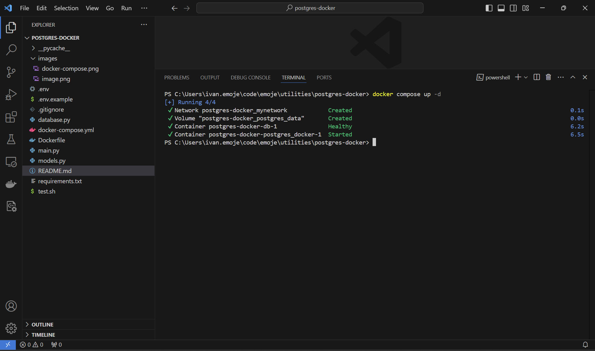
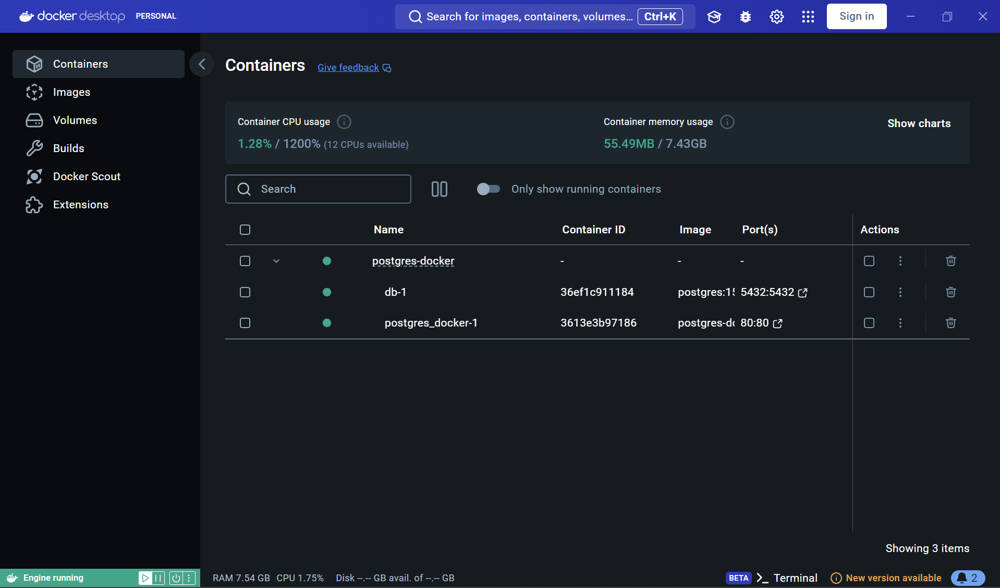
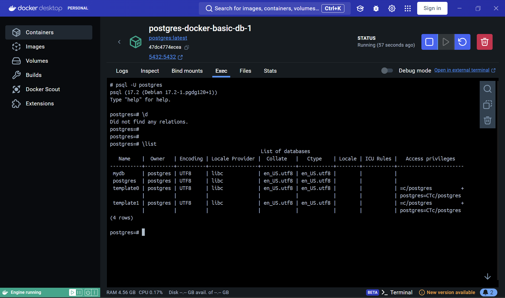

# Setting Up a PostgreSQL Container with Docker

PostgreSQL is a powerful, open-source relational database management system. In this repository, we'll walk through the process of spinning up a PostgreSQL container using Docker and connecting it to a client like DBeaver or pgAdmin.

## Available Translations

- [English](locales/en/README.md)
- [Español](locales/es/README.md)
- [Deutsch](locales/de/README.md)
- [Français](locales/fr/README.md)

## Pre-requisites
- [Docker](https://www.docker.com/)
- [Docker Windows](https://www.docker.com/)
- [PgAdmin](https://www.pgadmin.org/) or [DBeaver](https://dbeaver.io/)

## Images

